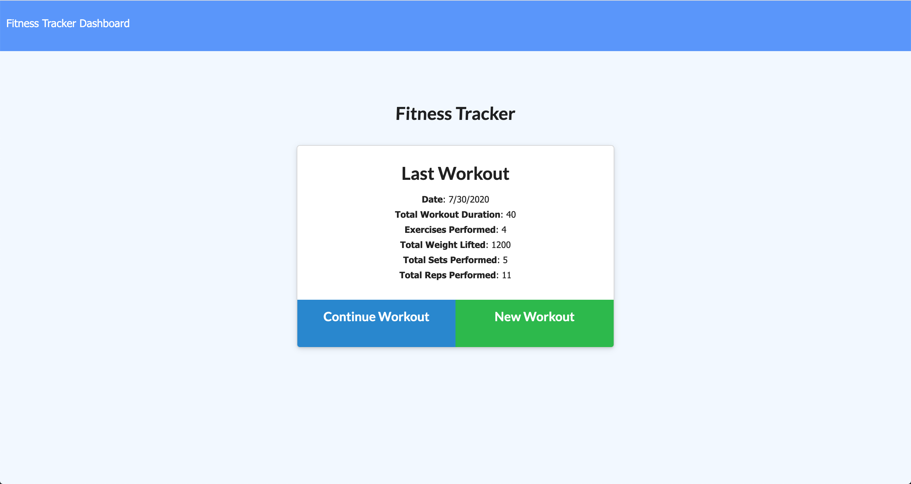

# Workout_Tracker


# General Info
- Workout Tracking application -- tracks the your exercise routine and outputs the result(s) with different graphs (via chart.js).
- Use the Application here: [Workout Tracker](https://workout-tracker-tkj.herokuapp.com/) 

#### Built With: 
- Mongo database
- Mongoose schema 
- Routes with Express 
- HTML, CSS, JavaScript and jQuery for the front end

#### Goal/Scenario: 
- The overall goal of this application is to design the back-end logic for the front-end work that had already been completed. This simulates environments where a front end team may deliver a PBI for the back end team to finish the integrations, and deliver a fully functioning application to the end user.


#### Appication Overview:


- Users are greeted with the Last Workout logged stats, and then can start inputting their next workout details.


- Users can input info on the type of exercise, like Cardio. Setting up the distance and duration of the exercise and adding it to the application.


- User can also enter information like sets and reps for Resistance exercises.


- User can then review their stats with lovely graphs to visualize their progress

## Deployment

#### Locally

To install and use locally,

1. `git clone` the repository to a local directory
2. In the terminal, `cd` to the repository directory and run

```bash
npm i
```

3. Then start the application with:

```bash
node server.js
```

4. You can then navigate to [http://localhost:3000/](http://localhost:3000/) in your browser of choice

#### Online
All that being said, you can find the deployed application on Heroku. Navigate to the [Workout Tracker](https://workout-tracker-tkj.herokuapp.com/) online and save yourself some time and effort!
